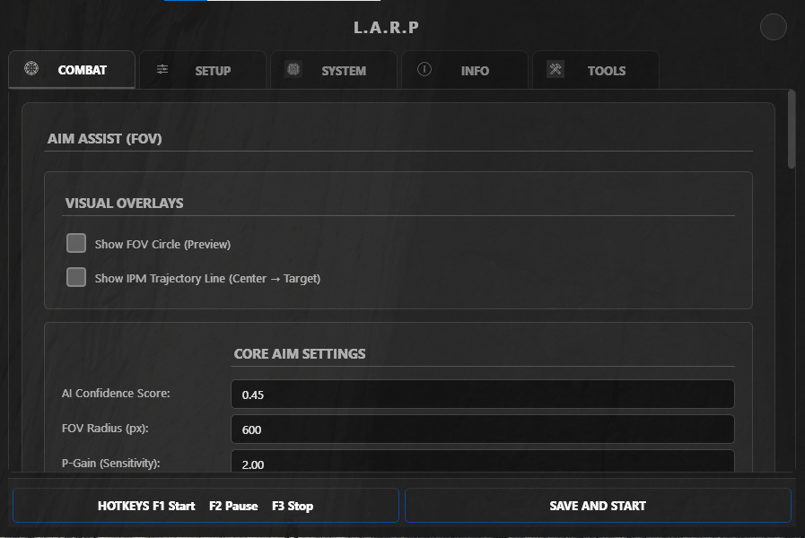

# 🤖 L.A.R.P — AOTR Bot v1



**L.A.R.P** (Logic AI Robotic Program) is an AI-powered bot for **Attack on Titan: Revolution (AOTR)** on Roblox. It uses a real-time YOLO object detection model to automate gameplay — targeting, combat, reconnecting, and more.

> This is the runtime package. Training tools, datasets, and dev utilities are excluded.


---

## Table of Contents
- [Features](#features)
- [Requirements](#requirements)
- [Setup](#setup)
- [Hotkeys (Default)](#hotkeys-default)
- [Project Structure](#project-structure)
- [Strategy & Recommended Build](#strategy--recommended-build)
- [Troubleshooting](#troubleshooting)
- [Frequently Asked Questions (FAQ)](#frequently-asked-questions-faq)
- [Bug Reporting & Contact](#bug-reporting--contact)
- [Discord Setup (Optional)](#discord-setup-optional)
- [Notes](#notes)

---

## Features

- **AI Combat Engine** — Real-time YOLO detection with Kalman-filter aim assist and dynamic lead prediction
- **Auto-Reconnect** — Monitors Roblox logs and automatically relaunches on disconnect (Error 277, 279, 529, etc.)
- **Macro Playback** — Static approach macro + dynamic airborne pendulum combat engine
- **Discord Integration** — Live status notifications, reward tracking, and remote control via Discord bot and webhooks
- **Settings GUI** — Full PyQt6 settings panel with hot-reload support
- **Debug Overlay** — On-screen detection visualization with FOV circle

---

## Requirements

- **OS:** Windows 10/11
- **Python:** 3.10+
- **GPU:** NVIDIA GPU strongly recommended (**Minimum 4GB VRAM** required for smooth real-time YOLO inference)
- **Roblox:** Must be running before the bot starts

---

## Setup

### Option A — Automatic (Recommended)
Double-click **`install.bat`** — it will:
1. Check your Python version
2. Ask if you have an NVIDIA GPU and install the correct PyTorch build
3. Install all remaining dependencies
4. Create `config.json` from the template
5. Create required folders

Then place your model in `assets/models/` and double-click **`run.bat`** to start.

---

### Option B — Manual

### 1. Install Dependencies
```bash
pip install -r requirements.txt
```

### 2. Place Your YOLO Model
Copy your trained model into `assets/models/`:

| Format | Status | Notes |
|---|---|---|
| `best.pt` | Supported | PyTorch — requires CUDA for GPU inference |
| `best.onnx` | Not yet supported | Planned for a future release |
| `best.engine` | Not yet supported | Planned for a future release |

The bot auto-detects the latest `train_YYYYMMDD_HHMM` subfolder inside `assets/models/` and loads `best.pt` from it.

To point to a specific model file, set `model_path` in `config.json`:
```json
"model_path": "assets/models/train_20260405_0650/best.pt"
```
Paths can be relative (resolved from the project folder) or absolute.

### 3. Configure
```bash
# Copy the example config and fill in your values
cp config.example.json config.json
```

Edit `config.json` with:
- Your Discord bot token and webhook URLs (optional)
- Your screen resolution (`screen.width` / `screen.height`)
- Your macro file path (optional — leave empty for Dynamic Combat only)

### 4. Run
```bash
python main.py
```

---

## Hotkeys (Default)

| Key | Action |
|---|---|
| `F1` | Start / Resume bot |
| `F2` | Pause bot (opens Settings GUI) |
| `F3` | Stop and Exit |

Hotkeys are configurable in `config.json` under `"bot"`.

---

## Strategy & Recommended Build

For optimal bot performance, we highly recommend following our specific build guide (including family, perks, stats, and modifiers). 

👉 **[Read the Recommended Build Guide (STRATEGY.md)](STRATEGY.md)**

---

## Troubleshooting

### 1. PyTorch / CUDA Version Mismatch
If the bot crashes on startup or runs extremely slowly on an NVIDIA GPU, your PyTorch version likely doesn't match your CUDA drivers.
- **Fix:** Uninstall the current PyTorch (`pip uninstall torch torchvision`) and reinstall the correct version using the command from the [official PyTorch website](https://pytorch.org/get-started/locally/). Ensure you select the CUDA version that matches your system. Alternatively, run `install.bat` again and select `Y` for the GPU installation.

### 2. Bot Doesn't Click / Move
- Ensure Roblox is the active window.
- Make sure you are running the bot as Administrator if required by your system.
- Check the `config.json` to ensure your `screen.width` and `screen.height` match your actual display resolution.

### 3. "Model not found" Error
- Make sure you have placed your trained `.pt` model inside the `assets/models/` folder. The bot will not run without it.

---

## Frequently Asked Questions (FAQ)

**Q: Why is the bot shooting at trees/buildings instead of Titans?**
> **A:** The AI model relies on visual patterns. If the in-game lighting is unusual or your graphics settings are too low/high, it might get confused. Ensure you are playing in standard weather (avoid heavy fog if possible) and try adjusting the `confidence` threshold in the Settings GUI. If the issue persists, the YOLO model might need retraining on a more diverse dataset.

**Q: The bot feels very slow and my FPS drops significantly.**
> **A:** The bot runs a heavy AI model in real-time. Make sure your PC meets the **Minimum 4GB VRAM** requirement. You can also lower the `target_fps` in the Settings GUI to reduce the scanning frequency and free up CPU/GPU resources for the game.

**Q: I get a CUDA error when starting the bot!**
> **A:** This usually happens when your installed PyTorch version doesn't match your NVIDIA drivers. Please see Issue #1 in the **Troubleshooting** section above.

**Q: The bot says it's running, but my character isn't moving or attacking.**
> **A:** Simulated inputs require the Roblox window to be actively focused. If you click on another monitor or open another app, the bot's keystrokes won't register in the game. Make sure Roblox is the active window. Also, try running the bot as Administrator.

**Q: Can I run this bot on Mac or Linux?**
> **A:** No. The bot relies on Windows-specific libraries (like `ctypes` for `win32gui`) to interact with the game window and simulate mouse/keyboard inputs. It is strictly designed for **Windows 10/11**.

**Q: Why is there no .exe version? Can I compile this to a single executable?**
> **A:** While possible, we do not provide or recommend a compiled `.exe` version. L.A.R.P uses massive AI libraries (like PyTorch and CUDA) that are several gigabytes in size. Compiling everything into a single executable would result in a file size exceeding **3 GB+**, which is far too bloated for a Roblox bot. Running it directly via Python is much more efficient and allows for easier updates.

---

## Bug Reporting & Contact

If you encounter a bug that isn't covered in the Troubleshooting or FAQ sections, please report it!

1. **GitHub Issues:** Open an issue on this repository. Please include your OS, GPU model, and a screenshot of the terminal error.
2. **Discord:** You can reach out directly to the developer on Discord: **`sgod666`**.

*Note: Please check the FAQ and Troubleshooting sections first before sending a message!*

---

## Project Structure

```
L.A.R.Pv1/
├── main.py                  <- Entry point
├── config.json              <- Your config (not tracked by git)
├── config.example.json      <- Config template (safe to share)
├── requirements.txt
├── bot/
│   ├── brain.py             <- Core state machine
│   ├── engine.py            <- Bot thread manager
│   ├── in_game_macro.py     <- Combat macro and aim assist
│   ├── detector.py          <- YOLO AI detection
│   ├── screen.py            <- Screen capture
│   ├── controller.py        <- Mouse and keyboard input
│   ├── reconnect.py         <- Auto-reconnect watchdog
│   ├── discord_bot.py       <- Discord integration
│   ├── settings_gui.py      <- Settings GUI (PyQt6)
│   ├── overlay.py           <- On-screen debug overlay
│   ├── ocr_utils.py         <- Reward detection (OCR)
│   ├── config.py            <- Config loader
│   └── templates/           <- Reward icon templates
├── assets/
│   └── models/              <- Place YOLO model here (not tracked by git)
└── logs/                    <- Runtime logs (auto-created, not tracked by git)
```

---

## Discord Setup (Optional)

1. Create a Discord bot at [discord.com/developers](https://discord.com/developers)
2. Copy the bot token into `config.json` under `discord_bot.token`
3. Create a webhook in your Discord server and paste the URL into `webhook_url`
4. Invite the bot to your server with `Send Messages` and `Read Messages` permissions

---

## Notes

- **Screen Resolution:** The bot natively supports **1080p** and **1440p** displays. You can configure your exact screen width and height in the Settings GUI.
- `config.json` is excluded from git (contains your private tokens). Use `config.example.json` as the template.
- AI model files (`*.pt`) are excluded from git due to their size. Distribute separately.
- The bot sets its working directory to the project root on startup — it can be run from any location.

---

## Disclaimer

> ⚠️ **USE AT YOUR OWN RISK.**
> 
> Although this bot does not inject code into the game client (it operates entirely via screen capture and simulated inputs), using any form of automated macro or auto-grinding bot may still violate Roblox's or the specific game's Terms of Service. The developers of L.A.R.P assume **zero responsibility** if your account gets restricted, banned, or penalized. Please use this tool responsibly.

---

## License

Copyright (c) 2026 SGOD. All Rights Reserved.

This project is licensed under a custom proprietary license. See [LICENSE](LICENSE) for full terms.

**In short:**
- You may view and use this software for personal, non-commercial purposes.
- You may NOT redistribute, sell, publish, or claim this software as your own.
- Modified versions may NOT be shared publicly without written permission.
